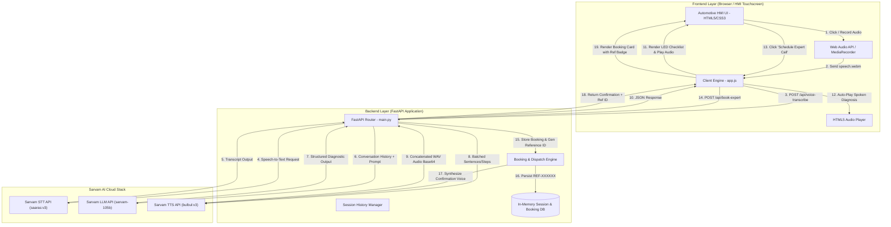
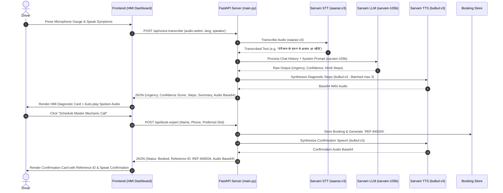

# 🏗️ Technical Architecture & System Design
## **Car AI Doctor — Multilingual Voice & Agentic Vehicle Diagnostic Assistant**

This document details the software architecture, data flow pipelines, API integration specs, and failure handling mechanisms for **Car AI Doctor**.

---

## 1. System Architecture Diagram

---

## 2. Component Specifications

### 2.1 Backend Layer (`main.py`)
* **Framework:** FastAPI (Python 3.9+)
* **Session Storage:** In-memory session store mapping `session_id` to conversational turns.
* **Booking Engine:** Generates unique Customer Reference IDs (`REF-XXXXXX`), assigns Master Technicians, and formats confirmation messages.

### 2.2 Sarvam AI Service Layer (`sarvam_service.py`)
Encapsulates all communication with Sarvam AI REST endpoints:

* **Speech-to-Text (`saaras:v3`):**
  * **Endpoint:** `POST https://api.sarvam.ai/speech-to-text`
  * **Header:** `api-subscription-key: <SARVAM_API_KEY>`
  * **Payload:** `multipart/form-data` with `file`, `model="saaras:v3"`, `language_code`.

* **Diagnostic LLM (`sarvam-105b`):**
  * **Endpoint:** `POST https://api.sarvam.ai/v1/chat/completions`
  * **Header:** `Authorization: Bearer <SARVAM_API_KEY>` *(Note: Bearer token auth required for 105b)*
  * **Payload:** `model="sarvam-105b"`, `messages`, `temperature=0.1`, `max_tokens=2000`.
  * **Timeout:** 60.0 seconds (handles deep reasoning passes).

* **Text-to-Speech (`bulbul:v3`):**
  * **Endpoint:** `POST https://api.sarvam.ai/text-to-speech`
  * **Header:** `api-subscription-key: <SARVAM_API_KEY>`
  * **Payload:** `model="bulbul:v3"`, `inputs` (max 3 inputs per request), `speaker`, `target_language_code`.
  * **Multi-Chunk Merge:** Batches input lines into groups of 3, executes parallel/sequential requests, strips 44-byte WAV headers, concatenates raw PCM bytes, and re-encodes a single valid WAV file in base64.

---

## 3. Sequence Diagram — Voice Triage & Expert Dispatch

---

## 4. Failure & Resilience Handling

| Potential Failure Point | Mitigation Strategy |
|---|---|
| **LLM Timeout (>20s)** | Extended `httpx` async client timeout to **60.0 seconds** to accommodate deep multi-language reasoning passes. |
| **TTS Input Limit Exceeded (>3 items)** | `sarvam_service.py` automatically batches inputs into groups of 3, executes multiple requests, and concatenates raw PCM audio chunks into one seamless base64 WAV. |
| **Non-Standard LLM Output** | Dual-pass regex parser: matches `Step N:` / `चरण N:` patterns first, falls back to markdown bullet lists, and then Devanagari character block extraction. |
| **Missing API Key** | App status endpoint `/api/health` detects configuration state and provides clear diagnostic messages in logs. |
| **Microphone Denial** | Graceful UI fallback allows typed diagnostic inputs with full access to STT/LLM/TTS and Expert Dispatch workflows. |
