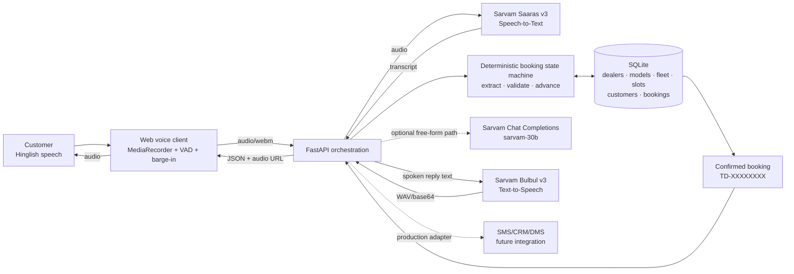
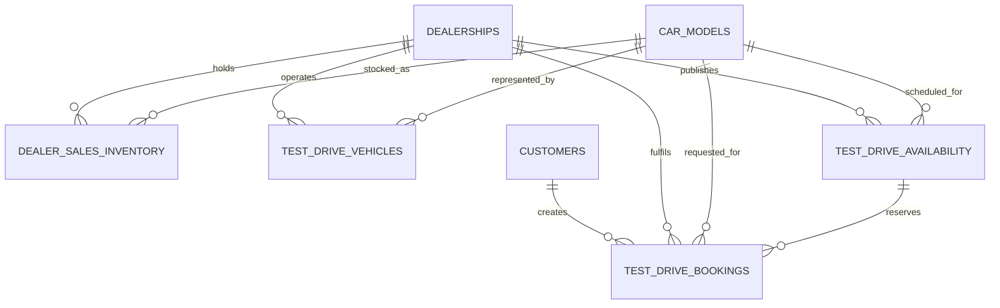

# Maruti Customer Concierge — Solution Architecture

## 1. Executive summary

The Maruti Customer Concierge is a browser-based Hinglish voice assistant that converts a customer’s spoken intent into a confirmed test-drive booking. Sarvam AI provides the India-first voice layer: **Saaras v3** transcribes the customer and **Bulbul v3** speaks every reply. A FastAPI orchestration service maintains the conversation, applies a deterministic booking state machine, queries dealerwise SQLite inventory and availability, and creates the booking transaction.

The design deliberately separates **conversation** from **commitment**:

- Natural language makes the experience accessible.
- Deterministic validation controls model, dealership, date, time, location and customer-data transitions.
- SQLite transactions protect slot capacity and generate an idempotent booking reference.
- Sarvam TTS returns the confirmation and booking ID as speech.

This hybrid pattern is appropriate for enterprise sales operations: generative AI can assist with open-ended questions, while inventory and booking actions remain grounded, observable and testable.

## 2. System context



## 3. Runtime components

| Layer | Component | Responsibility |
|---|---|---|
| Experience | `static/index.html`, `static/js/app.js`, `static/css/style.css` | Browser UI, microphone capture, VAD, barge-in, conversation transcript, audio playback and booking confirmation |
| API | `main.py` | FastAPI routes, session history, Sarvam calls, slot validation, automatic booking finalisation and audio caching |
| Voice/AI | `sarvam_service.py` | Saaras v3 STT, Bulbul v3 TTS, Chat Completions for free-form paths, Hinglish normalisation and booking-state interpretation |
| Data | `database.py` | SQLite schema, demo seeding, dealer/model/fleet context, availability lookup and transactional booking |
| Regression | `tests/test_sales_workflow.py` | Protects model-alias and Dwarka dealer-selection transitions used in the demonstrated journey |

## 4. End-to-end booking sequence

```mermaid
sequenceDiagram
    autonumber
    actor Customer
    participant Browser as Voice client
    participant API as FastAPI
    participant STT as Sarvam Saaras v3
    participant Flow as Booking state machine
    participant DB as SQLite
    participant TTS as Sarvam Bulbul v3

    Customer->>Browser: Speaks in Hinglish
    Browser->>API: POST /api/voice-transcribe
    API->>STT: Audio + hi-IN
    STT-->>API: Transcript
    API->>Flow: Transcript + session history
    Flow->>DB: Read models, dealers and availability
    DB-->>Flow: Grounded catalogue and slot data
    Flow-->>API: One customer-facing reply + next missing field
    API->>TTS: Reply text + selected voice
    TTS-->>API: Synthesised audio
    API-->>Browser: Transcript, reply, audio and state
    Browser-->>Customer: Plays reply

    loop Until required fields are complete
        Customer->>Browser: Model / dealer / slot / details
        Browser->>API: Next voice turn
        API->>Flow: Validate and advance exactly one stage
    end

    Flow->>DB: BEGIN IMMEDIATE; re-check capacity
    DB->>DB: Upsert customer; increment booked quantity; insert booking
    DB-->>Flow: TD-XXXXXXXX
    Flow-->>API: Booking confirmation
    API->>TTS: Booking ID + SMS expectation
    TTS-->>Browser: Confirmation audio
    Browser-->>Customer: Speaks booking ID
```

## 5. Deterministic booking state

The conversational state is inferred from the session history and advances in this order:

```text
MODEL
  → DEALERSHIP
  → DATE + TIME
  → LOCATION (HOME | DEALERSHIP)
  → CUSTOMER NAME
  → MOBILE
  → COMPLETE ADDRESS + PINCODE
  → SLOT REVALIDATION
  → CONFIRMED BOOKING ID
```

Important controls:

- The assistant asks for one missing field at a time.
- Known STT variants such as “ईवी टेरा” and “विटारा” resolve to `e VITARA`.
- Hindi relative dates and spoken times are normalised before slot lookup.
- Mobile numbers and pincodes are normalised from spoken digits and validated.
- The selected slot is checked before customer details are collected and again inside the booking transaction.
- A repeated final turn returns the existing confirmed booking instead of consuming capacity twice.
- If a slot is full, the transaction rolls back and the customer is asked for another time.

## 6. Data model



The local demo seeds New Delhi and Dwarka dealerships, Maruti Arena/NEXA models, dealerwise sales inventory, test-drive vehicles and 30 days of datewise slot capacity. Booking writes update the customer record, reserve the selected slot and create a `TD-XXXXXXXX` reference in one transaction.

## 7. API surface

| Endpoint | Purpose |
|---|---|
| `GET /api/assistant/welcome` | Generate the welcome text and Sarvam TTS audio |
| `POST /api/voice-transcribe` | Run the complete audio → transcript → workflow → reply → audio turn |
| `POST /api/chat` | Run the same workflow for typed input |
| `GET /api/dealerships` | Return configured dealer locations |
| `GET /api/cars` | Return dealerwise catalogue and demo inventory |
| `GET /api/test-drive/availability` | Return remaining slot quantities for a model, dealer and date |
| `POST /api/test-drive/bookings` | Create a transactional test-drive booking |
| `GET /api/test-drive/bookings/{reference_id}` | Retrieve a booking |
| `POST /api/test-drive/bookings/{reference_id}/cancel` | Cancel a booking and restore capacity |
| `POST /api/tts` | Generate replay audio for a text response |
| `GET /api/health` | Report service, model and database status |

## 8. Security, privacy and operational controls

- The Sarvam API key is supplied only through environment configuration and is excluded from Git.
- Full driving-licence, Aadhaar and PAN numbers are not required by the voice workflow. The customer is reminded to keep originals available at the test drive.
- Production should move session state from process memory to Redis and SQLite to a managed relational database.
- Production should add authentication, rate limits, encryption at rest, audit logging, PII retention rules and consent evidence.
- The current “SMS sent” message is a simulation. A real SMS/CRM adapter must record delivery status before making that assurance in production.
- Observability should track STT failures, state retries, average turn latency, slot conflicts, booking completion and handoff rate.

## 9. Deployment path

For a pilot, package the FastAPI service as a container behind HTTPS, use managed Postgres for transactional data, Redis for conversation state, an object store for short-lived audio where required, and a secrets manager for Sarvam credentials. Connect the same orchestration endpoints to telephony, CRM/DMS and SMS adapters without changing the deterministic booking contract.

## 10. Current PoC boundaries

- Browser microphone rather than live telephony
- Hinglish demonstration using `hi-IN`
- Seeded demo catalogue and dealer inventory, not a live DMS feed
- Process-local session memory
- Simulated SMS acknowledgement
- No production identity, consent, retention or analytics layer

These boundaries are intentionally visible in the deck and rollout plan.
